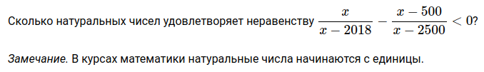
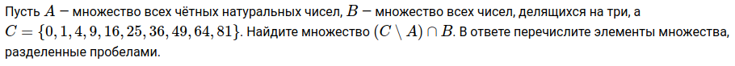
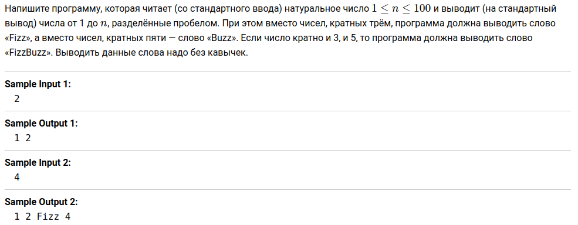
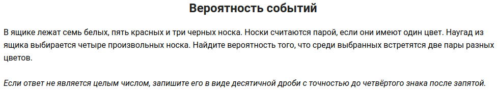
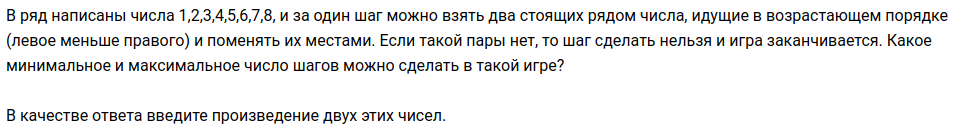
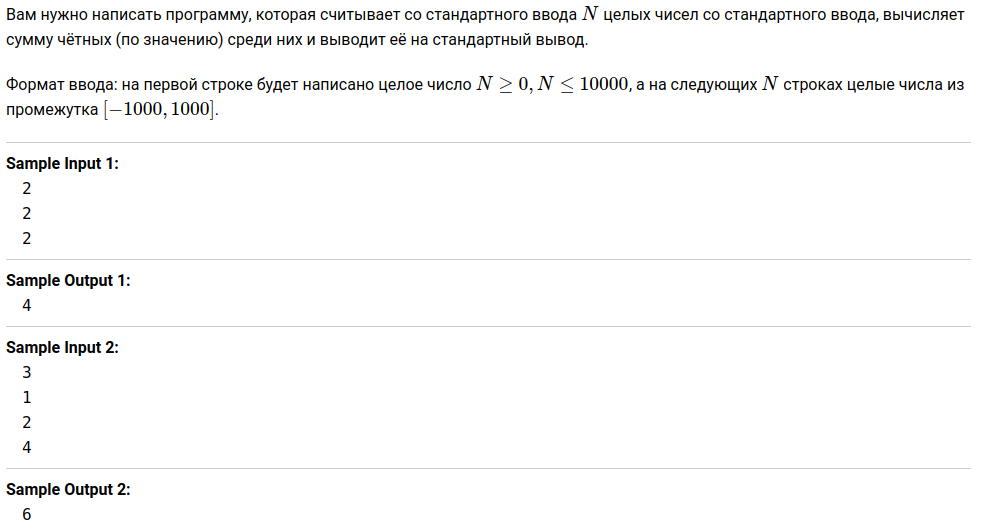

# Задания

## [naturalnum.py](naturalnum.py)

<kbd></kbd>

## [elofset.py](elofset.py)

<kbd></kbd>

## [naturalprint.py](naturalprint.py)

<kbd></kbd>

## [probabilities.py](probabilities.py)

<kbd></kbd>

## [permutations.py](permutations.py)

<kbd></kbd>

## [naturalsum.py](naturalsum.py)

<kbd></kbd>
